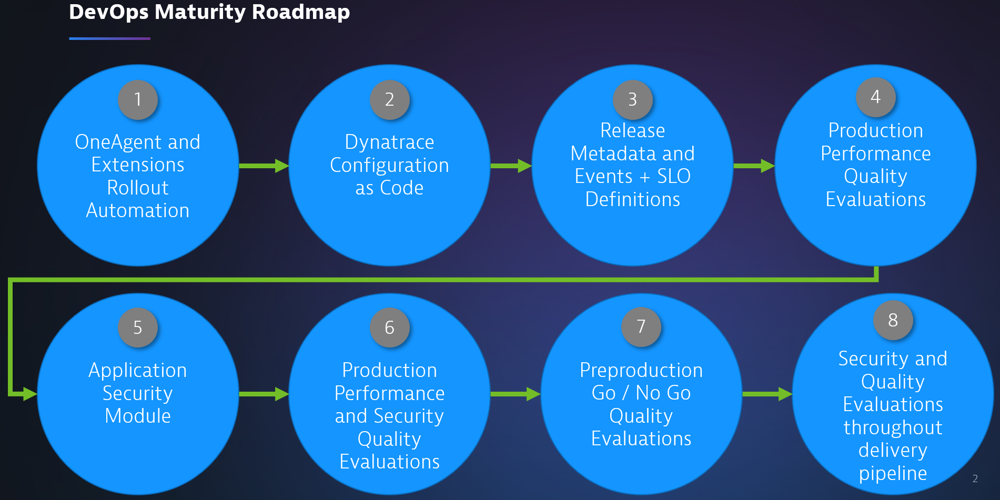

# Dynatrace DevOps Maturity Roadmap

The training that follows assumes the following conceptual roadmap.

Imagine a brand new customer who asks "how to I use Dynatrace help do DevOps properly?"

This is not definitive. Feel free to add and remove steps along the way for whatever suits your customer. Use this as a guide rather than a prescription.

1. Standard customer activities: Automating the OneAgent and extensions rollout
2. All about Dynatrace-as-code (eg. Monaco or DT Terraform provider)
3. Software version and release tracking with Dynatrace (using the in-product release screen). Defining Service Level Objectives for important services and metrics.
4. Production: Post-release automated quality evaluations: Was the release I did good or not (in terms of performance)?
5. Add in security metrics
6. As step 5 but now incorporating security metrics: Was the release I did good or not (performance) and is it secure?
7. Simply shifting step 6 left "one step" so the customer performs this step **before** release and uses the output as their go / no go decision
8. A continual process whereby the customer sees value and gradually shifts the above "further left" getting closer to development

> By the end of this process, you will have Dynatrace embedded across every environment and every application. The csutomer will be fully utilising not only Dynatrace DAVIS in production but the full capability of the product across their Software Delivery Lifecycle.