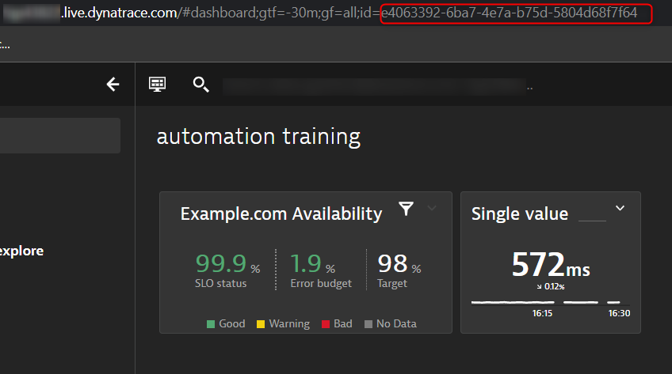

## Create Dynatrace Items

1. Create a Synthetic script to monitor `http://example.com`.
2. Create an SLO to monitor the availability percentage of the synthetic test. Set the threshold to 98.00% and 99.00% (warning)
3. Create a dashboard and place two tiles on the dashboard:
    1) The SLO above
    2) The synthetic test response time

Make a note of the dashboard ID.

## Create a Dynatrace API Token

With the following permissions:

- TODO
