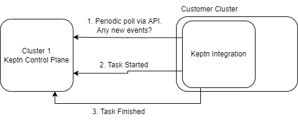

## Remote Clusters

So far you have been working on the same Kubernetes cluster. In most cases though, the Keptn control plane will be provided -aaS by Cloud Automation so you need to know how to run services remotely.

Keptn and Cloud Automation are fully compatible with things running outside the control plane cluster. The architecture is a polling-based retrieval. For example:

Notice:

1) All communications are initiated outbound from the remote cluster
2) Communications are via HTTP API meaning the remote "integration" is usually (but does not have to be) a kubernetes pod.

Keptn integration services are deployed with a container called a distributor. It is this pod (prewritten by the Keptn team) that handles all of the subscription and "checking" logic. So you do not need to worry about that.

More information is available here:
- https://keptn.sh/docs/concepts/architecture/#execution-plane-services
- https://keptn.sh/docs/0.16.x/integrations/custom_integration/

## Exercise: Write an Integration

In your groups, demonstrate that Keptn integrations can be run from anywhere.

Write a script (in any language you feel comfortable with) that does the following:

1. Runs in an endless loop and periodically checks the Keptn /api/v1/event endpoint for new events of whatever type you like.
2. When a new event is "heard", your script (whatever you decide it to be) should run
3. At the very start of your script you should crafted and send a `started` event back to Keptn control plane
4. At the very end of your script you should craft and send a `finished` event back to Keptn
5. If your script runs for a long time, you can optionally send 1 or more `status.changed` events during the execution (ie. after the `started` but before the `finished` event).
