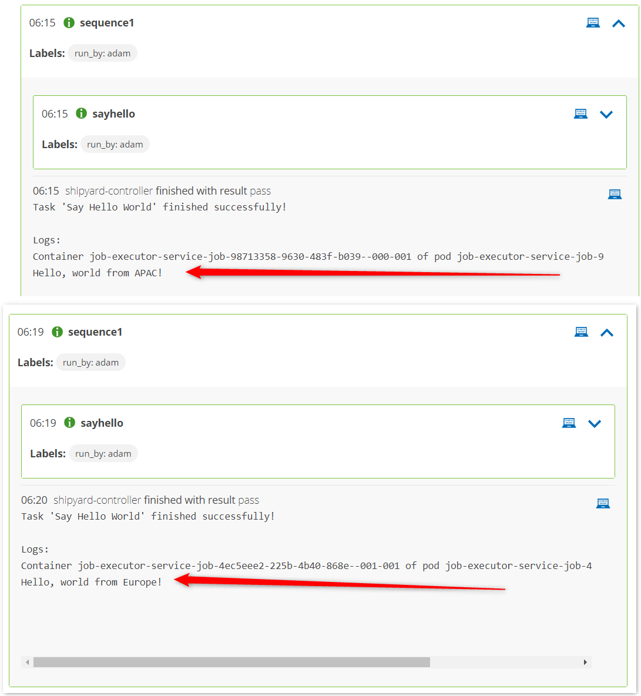

## Remote Clusters

So far you have been working on the same Kubernetes cluster. In most cases though, the Keptn control plane will be provided `aaS` by Cloud Automation so you need to know how to run services remotely.

Keptn and Cloud Automation are fully compatible with things running outside the control plane cluster. The architecture is a polling-based retrieval. For example:


Notice:

1) All communications are initiated outbound from the remote cluster
2) Communications are via HTTP API meaning the remote "integration" is usually (but does not have to be) a kubernetes pod.

Keptn integration services are deployed with a container called a distributor. It is this pod (prewritten by the Keptn team) that handles all of the subscription and "checking" logic. So you do not need to worry about that.

More information is available here:
- https://keptn.sh/docs/concepts/architecture/#execution-plane-services
- https://keptn.sh/docs/0.16.x/integrations/custom_integration/

## Exercise: Simulate Global Load Testing

Imagine you have multiple clusters around the world. You want Keptn to orchestrate load testing (or some other task) but the system should be smart enough to dynamically start the test in different regions based on some metadata you pass in when you trigger the event.

Install a second job executor service in a new namespace called `keptn-jes-eu` and ensure it listens for the same `sayhello.triggered` event. Here, the new namespace simulates a different cluster and `sayhello` simulates a real task name (like `load`).

This time, because we're simulating a remote cluster (one without the Keptn control plane available), we cannot rely on the autoDetect mechanism to look up the Keptn API details for us. So we will explicitely set them based on your cluster details (docs are [here](https://github.com/keptn-contrib/job-executor-service/blob/main/docs/INSTALL.md) if you get stuck).

```
helm upgrade --install --create-namespace -n keptn-jes-eu \
job-executor-service "https://github.com/keptn-contrib/job-executor-service/releases/download/0.2.2/job-executor-service-0.2.2.tgz" \
--set remoteControlPlane.autoDetect.enabled="false" \
--set remoteControlPlane.topicSubscription="sh.keptn.event.sayhello.triggered" \
--set remoteControlPlane.api.token="<YOUR-KEPTN-API-TOKEN>" \
--set remoteControlPlane.api.hostname="1.2.3.4 (your keptn IP here)" \
--set remoteControlPlane.api.protocol="http"
```

Now adjust the `job/config.yaml` so `data.sayhello.location=APAC` responds with `Hello world from APAC` and `data.sayhello.location=EU` responds with `Hello world from EU`.

```
---
apiVersion: v2
actions:
  - name: "Run alpine image to say hello world from APAC"
    events:
      - name: "sh.keptn.event.sayhello.triggered"
        jsonpath:
          property: "$.data.sayhello.location"
          match: "APAC"
    tasks:
      - name: "Say Hello World"
        image: "alpine"
        cmd:
          - echo
        args:
          - 'Hello, world from APAC!'

  - name: "Run alpine image to say hello world from EU"
    events:
      - name: "sh.keptn.event.sayhello.triggered"
        jsonpath:
          property: "$.data.sayhello.location"
          match: "EU"
    tasks:
      - name: "Say Hello World"
        image: "alpine"
        cmd:
          - echo
        args:
          - 'Hello, world from Europe!'
```


Example CURL command to trigger the sequence with the correct metadata:
```
curl -X POST 'http://myKeptn.com/api/v1/event' \
-H 'x-token: *******************' \
-H 'Content-Type: application/json' \
--data-raw '{
    "data": {
        "labels": {
            "foo": "bar - labels are optional"
        },
        "project": "my-first-project",
        "service": "service1",
        "stage": "dev",
        "sayhello": {
            "location": "APAC"
        }
    },
    "source": "postman",
    "type": "sh.keptn.event.dev.sequence1.triggered",
    "specversion": "1.0",
    "shkeptnspecversion": "0.2.3"
}'
```



## Exercise: Write an Integration

In your groups, demonstrate that Keptn integrations can be run from anywhere.

Write a script (in any language you feel comfortable with) that does the following:

1. Runs in an endless loop and periodically checks the Keptn /api/v1/event endpoint for new events of whatever type you like.
2. When a new event is "heard", your script (whatever you decide it to be) should run
3. At the very start of your script you should crafted and send a `started` event back to Keptn control plane
4. At the very end of your script you should craft and send a `finished` event back to Keptn
5. If your script runs for a long time, you can optionally send 1 or more `status.changed` events during the execution (ie. after the `started` but before the `finished` event).
