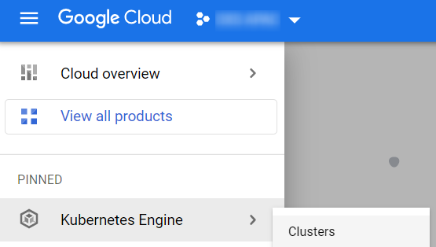
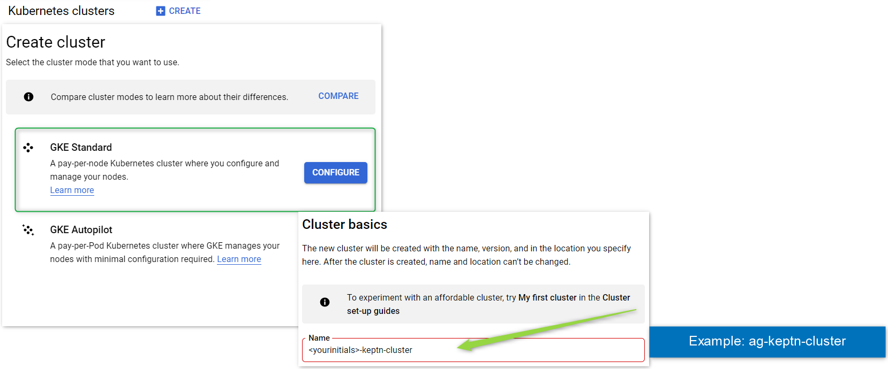
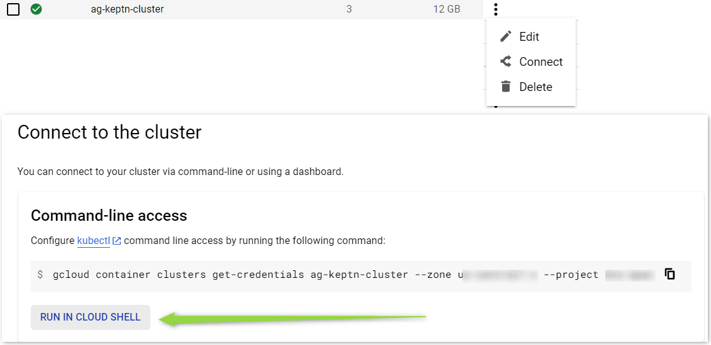
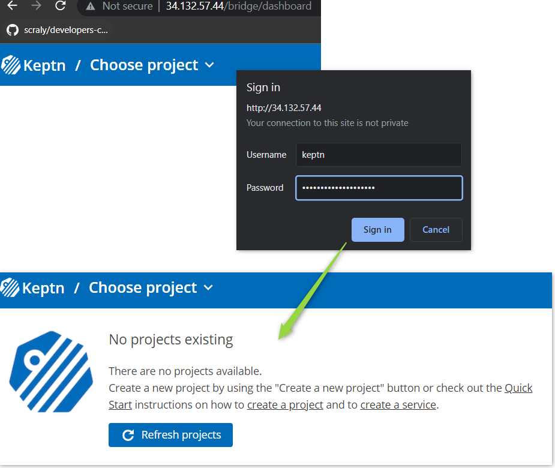
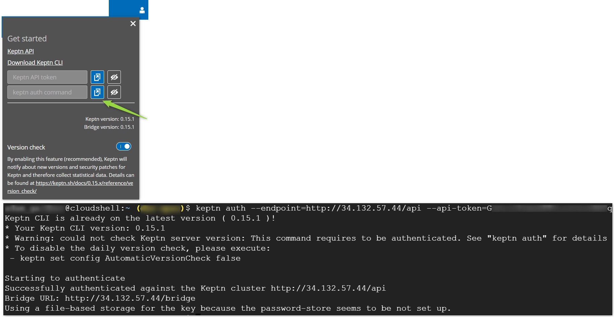
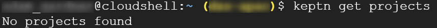

## Create k8s Cluster

### Create a Cluster

1. In GCP, go to `Kubernetes Engine > Clusters`



2. Click `Create`. Choose a GKE Standard cluster and set the name as `<yourinitials>-keptn-cluster`



3. Wait for cluster creation to finish (can take up to 15mins). Click the 3 dots icon > connect and `Run in cloud shell`



## Install Keptn CLI

Much like the `kubectl` command line tool for Kubernetes, Keptn comes with a `keptn` CLI tool to interact with your Keptn installations.

Install it now:

```
curl -sL https://get.keptn.sh | KEPTN_VERSION=0.15.1 bash
```

Verify:

```
keptn version
```

## Install Keptn Control Plane on Cluster

Keptn is a set of microservices. It is useful to think of Keptn as a two-part product:

1. The Keptn control plane: This is the set of microservices that form the "brains" and processing logic
2. The Keptn execution plane: Any out-of-the-box or additional microservices you add to "do stuff"

Install the Keptn control plane on your cluster and expose it on a LoadBalancer:

```
helm repo add keptn https://charts.keptn.sh && helm repo update
helm install keptn keptn/keptn \
-n keptn --create-namespace \
--wait \
--version 0.15.1 \
--set=control-plane.apiGatewayNginx.type=LoadBalancer
```

Keptn is installed in the `keptn` namespace. Run `kubectl -n keptn get service` to show the Load balancer IP. Visit that in a web browser. This is the Keptn bridge.

## Retrieve Keptn Bridge Username and Password

Retrieve the Keptn bridge Username (default: `keptn`)
```
kubectl -n keptn get secret bridge-credentials -o jsonpath={.data.BASIC_AUTH_USERNAME} | base64 -d ; echo
```

Retrieve the Keptn bridge password:
```
kubectl -n keptn get secret bridge-credentials -o jsonpath={.data.BASIC_AUTH_PASSWORD} | base64 -d ; echo
```

Login to the bridge with these details.




## Authenticate keptn CLI

Under the "little person" icon on the top right of the screen you'll see a link to copy a prefilled `keptn auth` command.

Click the blue box to copy it to the clipboard and run that in Google cloud shell



Validate by running `keptn get projects`. This should currently show `No projects found`



## Questions

### Why is Killercoda not used?

The killercoda environments expire and this way, you have a persistent cluster, all settings and files for reference after the training

### Does Keptn work with GKE Autopilot?
Yes, but since Autopilot evaluates and creates nodes on-the-fly when pods start, Autopilot can be very slow.

For this reason only, the training uses a standard cluster.
