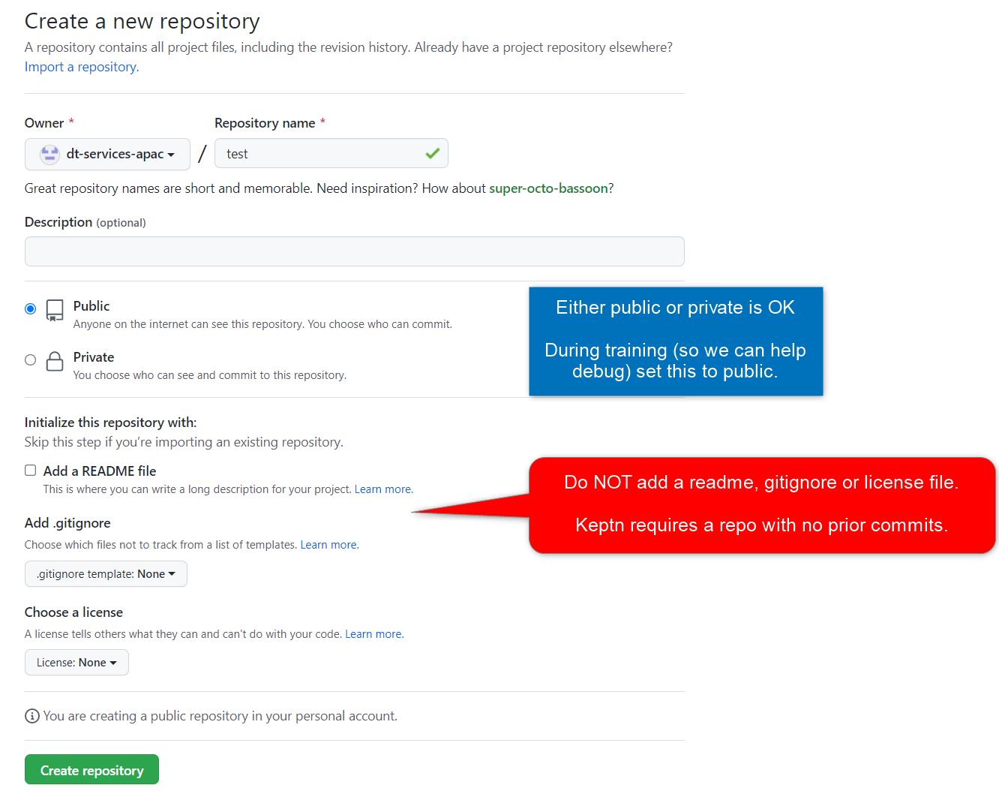
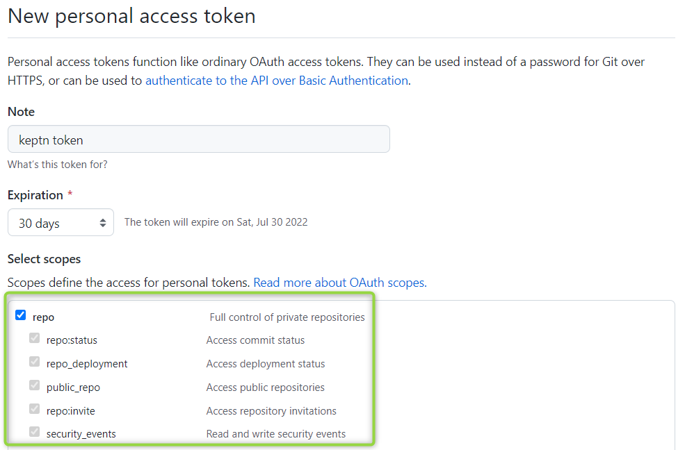
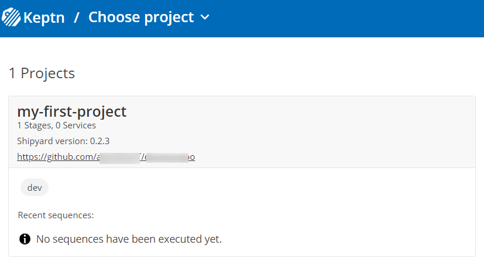
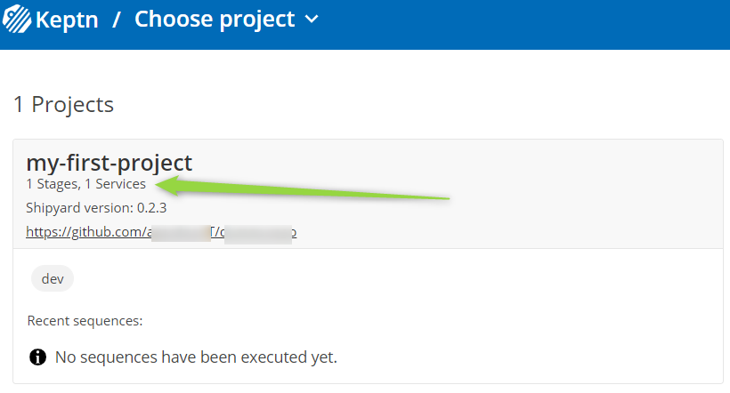

## Preparation

Create a new blank and uninitialised (no readme or prior commmits) Git Repo under your GitHub.com account. Keptn requires this to self-manage it's resources and configuration.



Create a GitHub [personal access token](https://github.com/settings/tokens/new) and assign full `Repo` permissions. Keptn uses this token to allow CRUDing the configuration files it manages.



## Create A Keptn Project


Read [this page](https://keptn.sh/docs/0.15.x/manage/project/) to understand what a Keptn project is and how one is created.

Download a demo project which contains one stage (`dev`), one sequence `sequence1` and one task within that sequence (`sayhello`).

```
wget https://raw.githubusercontent.com/dt-apac-services/automationtraining/main/shipyard.yaml
```

Modify and run the following in Google cloud shell to create a Keptn project from this Shipyard definition:

```
keptn create project my-first-project \
--shipyard shipyard.yaml \
--git-user=<YourGitUsername> \
--git-token=<YourGitPATToken> \
--git-remote-url=<YourGitRepository>
```

At this point you should see the following. Notice your Git upstream repo is now linked to this Keptn project.



## Create a Keptn Service

A Keptn service models a microservice. It is a logical grouping that spans stages. The idea being that you can run a sequence (for example a deployment) for a particular microservice that spans different Keptn stages. We will create a Keptn service called `service1`:


```
keptn create service --project my-first-project service1
```

Refresh the bridge and notice your new service is listed:


