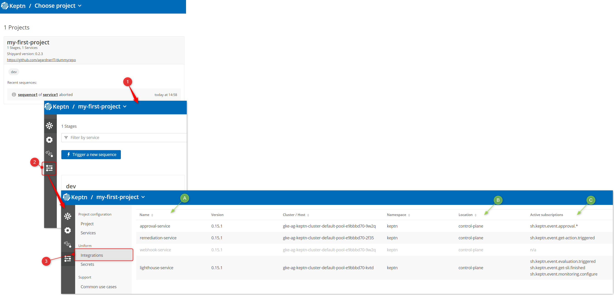

## Explore Keptn

From the bridge homepage, click your project (1) then click the settings menu icon (2) and choose Integrations (3)

## Keptn Integrations

Keptn comes with some "batteries included" meaning out-of-the-box it offers some common DevOps / SRE "tasks". However it is not opinionated and does not force you down any particular path or tool. Indeed that a core strength of Keptn. You get to decide what to do and what tools will do it - Keptn orchestrates things for you.

Tasks are actioned by Keptn services. In addition to the core microservices, Keptn ships with a few additional services:

1. Approval Service
2. Remediation Service
3. Webhook Service
4. Lighthouse Service

Every service listens for one or more cloudevents which correspond to tasks in the Shipyard file.

You are also in control of what events the services listen for - so if you don't like the way Keptn operates OOTB, just change it.

### Approval Service

The approval service listens for the `sh.keptn.event.approval.triggered` and implements a "delivery assistance" type role.

Depending on the result of a Keptn quality gate you can insert an approval step. For example: Automatically approve all passing builds but require manual intervention of the quality gate check fails. Or choose to require manual intervention for every release.

Documentation is [here](https://keptn.sh/docs/0.15.x/continuous_delivery/delivery_assistant/).

### Remediation Service

The remediation service is core during self-healing workflows with Keptn. This service listens for the `sh.keptn.event.get-action.triggered` whereby it looks up the self-healing action in the `remediation.yaml` file.

We will discuss this further later.

Documentation is [here](https://keptn.sh/docs/0.15.x/automated_operations/remediation/).

### Webhook Service

This is the service you will probably most commonly use in Keptn. You can configure the webhook service to listen for any `task` event and send a webhook request to any endpoint.

Think about it as curl for Keptn.

Documentation is [here](https://keptn.sh/docs/0.15.x/integrations/webhooks/).

### Lighthouse Service

This service is core during quality evaluations with Keptn. The lighthouse service performs a few different functions:

1. Listens for `sh.keptn.event.monitoring.configure`. This event is created when a user asks Dynatrace to monitor a particular project with an SLI provider (eg. Dynatrace). The Lighthouse service will create a k8s `ConfigMap` in response to this event.
2. Listens for `sh.keptn.event.evaluation.triggered` and determine the SLI data source (eg. Dynatrace, Prometheus, Datadog) and gather the SLI definitions (not data). It will then emit an event `sh.keptn.event.get-sli.triggered`. We will dive into this workflow later so don't worry if you don't understand now.
3. Listens for `sh.keptn.event.get-sli.finished` when your SLI service returns with data (eg. Dynatrace metrics have been retrieved), the Lighthouse service once again takes action and this time, evaluates the data and produces a quality gate report.

## Can I Add Extra Services?

Yes! There are services for hundreds of different tools and vendors. You can also create your own services.

That said, most of the time you will use the webhook service (eg. have Keptn trigger a third party service or a Lambda function) or want to run a container.