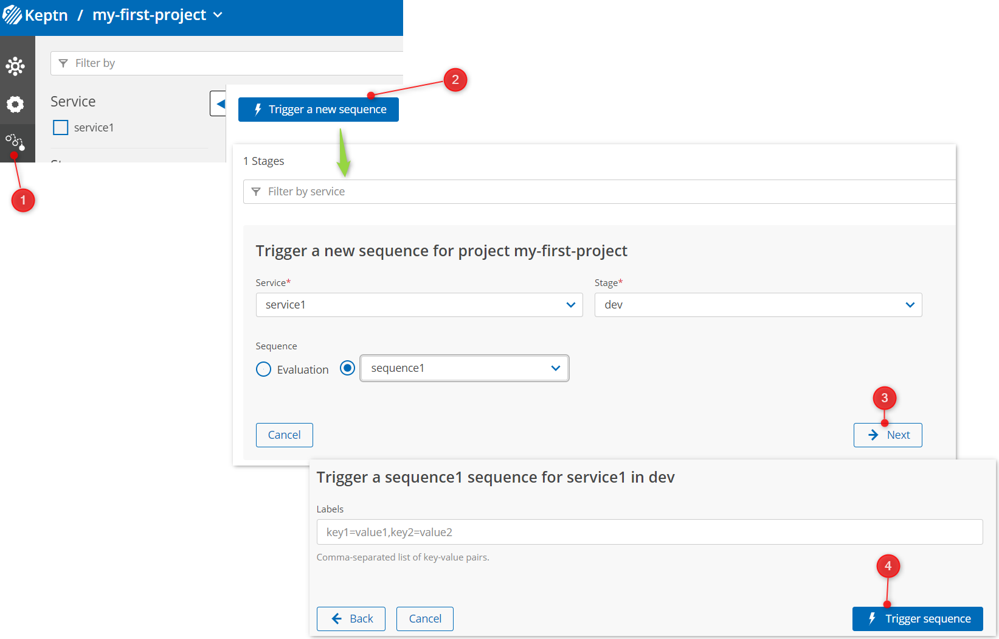

## Run Your First Keptn Sequence

It is time to run the first Keptn sequence.

1) Click the sequences list (1) then Trigger a new sequence (2). Set the service to `service1`, stage to `dev` and sequence to `sequence1`.
2) Add labels if you wish (optional) and click `Trigger sequence` (4)

Notice that your sequence is now running (1) and the `sayhello` task has automatically been started (cross reference this to your `shipyard.yaml` file).

## Question: Why is nothing happening?

Why is the `sayhello` task never starting (2) and your sequence eventually times out?

Discuss this with your team.