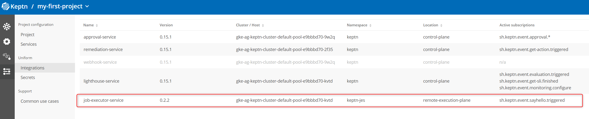
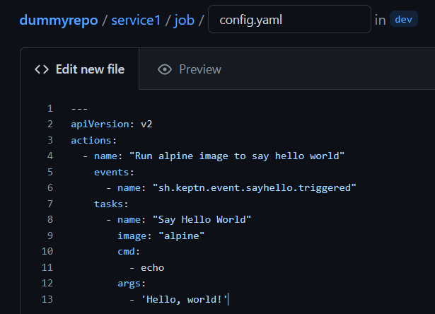
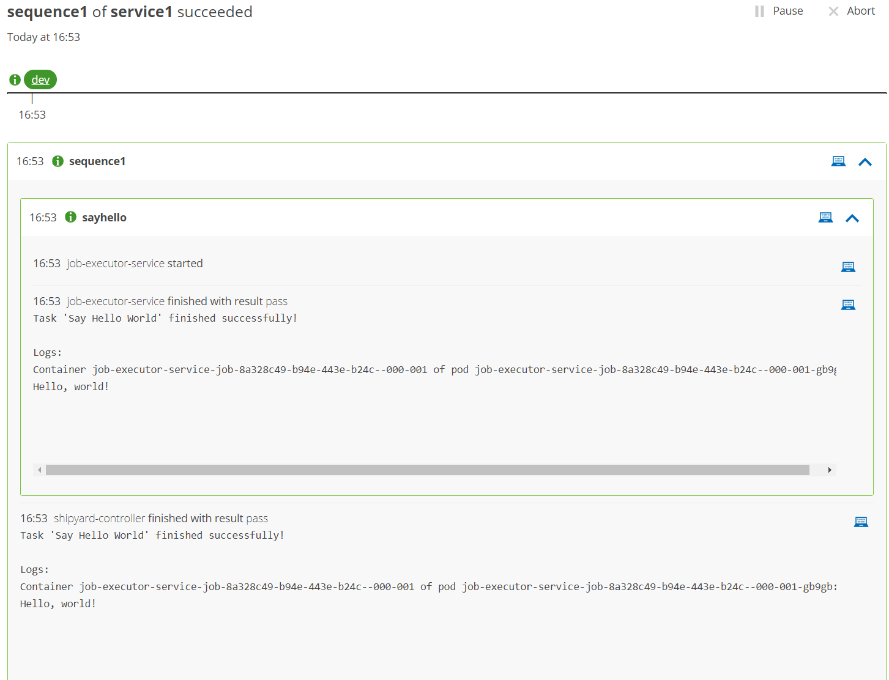

## Job Executor Service Runs (Almost) Anything

By now you know that your sequence timed out because you did not provide a service to **action** the task. This is a critical distinction with Keptn.

Keptn will orchestrate your tasks (and provide some built-in ones previously discussed) but for everything else - YOU decide how things are achieved.

So we need something to action the `sayhello` task...

## Over To You...

It is up to you how you action that task. Some ideas:

1. Use the webhook service to fire an API request to AWS and run a Lamba function
2. Use the webhook service to trigger a third party SaaS tool which does something
3. Run a container that you find on DockerHub (or build yourself) and make it say hello


Let's do the third one.

## Install Job Executor Service

The [job executor service (JES)](https://github.com/keptn-contrib/job-executor-service) is a very powerful Keptn service:

- Run any container in response to a Keptn task
- Serverless and lightweight (jobs created by JES only run as long as they're needed). Pods are not running when they aren't needed
- Low code approach (choose your event + choose your container = run the task. No coding required)

Install the JES now:

```
helm upgrade --install --create-namespace -n keptn-jes \
job-executor-service "https://github.com/keptn-contrib/job-executor-service/releases/download/0.2.2/job-executor-service-0.2.2.tgz" \
--set remoteControlPlane.autoDetect.enabled="true" \
--set remoteControlPlane.topicSubscription="sh.keptn.event.sayhello.triggered" \
--set remoteControlPlane.api.token="" \
--set remoteControlPlane.api.hostname="" \
--set remoteControlPlane.api.protocol=""
```

Notice three things:

1) Job executor service is installed into a new namespace: `keptn-jes`
1) During installation we tell the JES to listen for `sh.keptn.event.sayhello.triggered`
2) When the JES is installed to the same k8s cluster as Keptn core, it is smart enough to "figure out" how to connect back to Keptn core.

## Verify installation

`kubectl -n keptn-jes get pods` should show one running pod. This is the "master" pod that will run and spin up jobs whenever an event is "heard". All job pods will also run in `keptn-jes`.

In the bridge, go to the integrations screen and notice the job executor service is now registered as listening for `sh.keptn.event.sayhello.triggered`.

We will discuss more about "remote execution plane" later.



## Tell JES What to Do

The job executor service is listening for the `sayhello.triggered` event, but you have not told it what to do when it hears that event.

In your Git upstream repository, switch to the `dev` branch and into the `service1` folder.

Create a new folder called `job` and inside that folder, a file called `config.yaml` with the following content:

```
---
apiVersion: v2
actions:
  - name: "Run alpine image to say hello world"
    events:
      - name: "sh.keptn.event.sayhello.triggered"
    tasks:
      - name: "Say Hello World"
        image: "alpine"
        cmd:
          - echo
        args:
          - 'Hello, world!'
```



This file tells the JES that when the `sh.keptn.event.sayhello.triggered` event is "heard", JES should start a new alpine container (from a container registry like DockerHub) and run it with a command of `echo` and arguments of `Hello, world!`.

Now re-run your sequence and watch as JES responds and says hello!




Complete the follow exercises in your teams:

## Exercise: Say Something Different

Make the job executor say something different. Perhaps `Hello from Team X`

## Exercise: More Tasks

Add a second task so your sequence first prints "Hello world!" and then (as a separate task) prints "Hello world again"

## Exercise: Run a Different Container

Find a container image you know / like and have JES run that instead of `alpine`

## Exercise: Run a shell (or Powershell script) with JES

Create a shell or powershell script (contents are up to you). Have JES run that script.