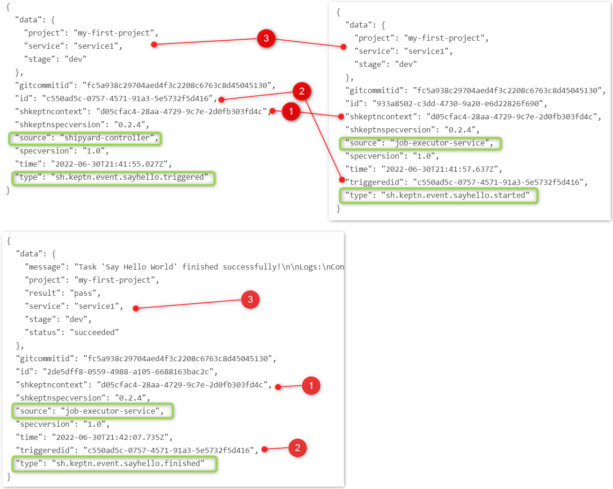

## Explanations Required...

> Warning: Deep dive technical details here!

At this point you have:

1. Keptn installed on a cluster (in the `keptn` namespace)
2. A third party Keptn service called the Job Executor Service installed on that cluster (in the `keptn-jes` namespace)
3. Some magic to run Keptn sequences

But how is all of this working?

## Start with the Shipyard

The shipyard file is the blueprint of your Keptn environment. A shipyard has a one-to-one relationship a Keptn project.

Go to the `main` branch of your Git repo and view the shipyard file:

```
apiVersion: spec.keptn.sh/0.2.3
kind: "Shipyard"
metadata:
  name: "my-first-keptn-project"
spec:
  stages:
    - name: "dev"
      sequences:
        - name: "sequence1"
          tasks: 
            - name: "sayhello"
```

Your Keptn project has one stage `dev`. Inside that stage you have defined one sequence `sequence1` and within that sequence is a single (or possibly more if you got the previous exercises working) task called `sayhello`.

You are responsible for writing the shipyard file. Keptn will not do this for you.

## Some Rules

1. Keptn requires a completely clean upstream Git repo for every new Keptn project. No workarounds, no hacks. Sorry!
2. Humans (or external tooling) trigger **sequences**. Tooling responds to **tasks**
3. The purpose of a Shipyard (and Keptn in general) is to separate process (as defined in the Shipyard file) from the tooling used to implement those choices
4. It is best practice NOT to have tooling names in your Shipyard file (eg. task should be called `deploy` not `deployWithJenkins`)
5. You can have as many stages as you want. These stages can be called anything you like
6. You can have as many sequences within stages as you want. Sequences can be named anything you want
7. You can have as many tasks within each sequence as you want. Task names can be anything you want
8. Some task names are considered "reserved" only because out-of-the-box Keptn services will respond to those task events (eg. `evaluation`)
9. One or more Keptn services can respond to the same task
9. Sequences can be standalone (default as shown above) or linked to one another (to form more complex workflows)
10. Sequences can be linked across stages (generating workflows that start to feel like delivery pipelines)
11. Sequences and tasks can be added and removed on-demand at any time
12. Currently (although this will change in the future) stages **cannot** be added or removed after initial project creation
   This is an acknowledged technical-debt limitation and will be removed in the future
13. The stage, sequence and task names are used by Keptn to dynamically generate CloudEvents


## CloudEvents and Keptn
Almost everything Keptn does is powered by CloudEvents.

Previously you triggered the `sequence1` sequence in the `dev` stage for the `service1` service from the bridge. Behind the scenes Keptn took that information and crafted a CloudEvent like this:

```
{
  "data": {
    "project": "my-first-project",
    "service": "service1",
    "stage": "dev"
  },
  "id": "autogenerated-uuid-here",
  "shkeptncontext": "autogenerated-uuid-different-to-id-here",
  "shkeptnspecversion": "0.2.4",
  "source": "bridge",
  "specversion": "1.0",
  "time": "autogenerated-datetime-here",
  "type": "sh.keptn.event.dev.sequence1.triggered"
}
```

How can you see this event? Open a sequence in the bridge and click the computer icon next to `sequence1`.


So we have triggered the sequence. What next?

Keptn now knows (thanks to the shipyard file) that this sequence contains one task: `sayhello`). So Keptn automatically crafts a second CloudEvent and distributes it for you.

Hint: you can see this in the bridge too. See if you can find it.

```
{
  "data": {
    "project": "my-first-project",
    "service": "service1",
    "stage": "dev"
  },
  "gitcommitid": "fc5a938c29704aed4f3c2208c6763c8d45045130",
  "id": "c550ad5c-0757-4571-91a3-5e5732f5d416",
  "shkeptncontext": "d05cfac4-28aa-4729-9c7e-2d0fb303fd4c",
  "shkeptnspecversion": "0.2.4",
  "source": "shipyard-controller",
  "specversion": "1.0",
  "time": "2022-06-30T21:41:55.027Z",
  "type": "sh.keptn.event.sayhello.triggered"
}
```

Recall that you told the job executor service to listen for the `sh.keptn.event.sayhello.triggered` event. That is how the JES begins working.

## Lifecycle of a Task

A Keptn task has a particular lifecycle:

1. A task is _triggered_. As shown above, tasks are **always** triggered by the shipyard controller (Keptn core).
    More accurately, Keptn core will know that a task needs to be triggered, craft and distribute a `sh.keptn.event.<taskname>.triggered` CloudEvent
2. A task is _started_. A Keptn service is responsible for crafting and sending this CloudEvent back to Keptn. This is how Keptn knows that "someone" has responded to a task and if more than one service responds, Keptn knows how many service can respond.
3. (optional) During execution, a Keptn service can optionally send **status changed** events back to Keptn.
    This is particularly useful for long running jobs so users know that progress is still being made but is not yet finished.
4. A task is _finished_. A Keptn service is responsible for crafting and sending this CloudEvent back to Keptn. If Keptn has received `n` `.started` events, it will wait for `n` `.finished` events

## So how does Keptn link sequence and task events together?

A Keptn service sends a `.started` event but there can be many projects and services running at once. How does Keptn correlate events?

Look at the sayhello events for a sequence: `sayhello.triggered`, `sayhello.started` and `sayhello.finished`.

Keptn core (the shipyard controller) generates and sends the `.triggered` event. It has an `id` and an `shkeptncontext`.

Think of `shkeptncontext` as a Purepath ID. It is a unique ID for this entire sequence (not just the task).

The `.started` event must use the `id` of the `.triggered` event in the `triggeredid` field. That's how the `.started` event is tied to the `.triggered` event.
The `.finished` event must also use the `id` of the `.triggered` event in the `triggeredid` field. That's how the `.finished` event is tied to the `.triggered` event.



## Summary and General Rules

1. Keptn generates a UUID for each sequence execution. This is the Keptn context ID and remains the same for all tasks and events in that singular sequence.
2. Keptn generates a unique ID for every event. This is different to the keptncontext ID.
3. `.started`, `.status.changed` and `.finished` events must take the `id` from the `.triggered` event and pass it back to keptn in the `triggeredid` field.
4. `.started`, `.status.changed` and `.finished` events can signal a `result` and a `status` to Keptn. Keptn uses this to influence the success of failure of each task.
5. Services can be "active" or "passive". There is no difference except their intended usage. "Active" services will be "doing" something (like a webhook triggering a Jenkins pipeline). A "passive" service is reactionary and will usually "be notifying" (eg. Send a Slack message).


