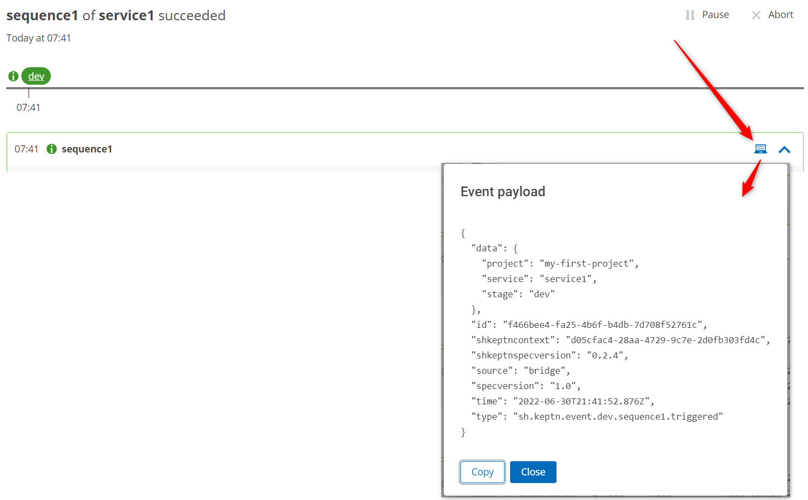

## Explanations Required...

At this point you have:

1. Keptn installed on a cluster (in the `keptn` namespace)
2. A third party Keptn service called the Job Executor Service installed on that cluster (in the `keptn-jes` namespace)
3. Some magic to run Keptn sequences

But how is all of this working?

## Start with the Shipyard

The shipyard file is the blueprint of your Keptn environment. A shipyard has a one-to-one relationship a Keptn project.

Go to the `main` branch of your Git repo and view the shipyard file:

```
apiVersion: spec.keptn.sh/0.2.3
kind: "Shipyard"
metadata:
  name: "my-first-keptn-project"
spec:
  stages:
    - name: "dev"
      sequences:
        - name: "sequence1"
          tasks: 
            - name: "sayhello"
```

Your Keptn project has one stage `dev`. Inside that stage you have defined one sequence `sequence1` and within that sequence is a single (or possibly more if you got the previous exercises working) task called `sayhello`.

You are responsible for writing the shipyard file. Keptn will not do this for you.

## Some Rules

1. Keptn requires a completely clean upstream Git repo for every new Keptn project. No workarounds, no hacks. Sorry!
2. Humans (or external tooling) trigger **sequences**. Tooling responds to task events
3. The purpose of a Shipyard (and Keptn in general) is to separate process (as defined in the Shipyard file) from the tooling used to implement those choices
4. It is best practice NOT to have tooling names in your Shipyard file (eg. task should be called `deploy` not `deployWithJenkins`)
5. You can have as many stages as you want. These stages can be called anything you like
6. You can have as many sequences within stages as you want. Sequences can be named anything you want
7. You can have as many tasks within each sequence as you want. Task names can be anything you want
8. Some task names are considered "reserved" only because out-of-the-box Keptn services will respond to those task events (eg. `evaluation`)
9. Sequences can be standalone (default as shown above) or linked to one another (to form more complex workflows)
10. Sequences can be linked across stages (generating workflows that start to feel like delivery pipelines)
11. Sequences and tasks can be added and removed on-demand at any time
12. Currently (although this will change in the future) stages **cannot** be added or removed after initial project creation
   This is an acknowledged technical-debt limitation and will be removed in the future
13. The stage, sequence and task names are used by Keptn to dynamically generate CloudEvents


## CloudEvents and Keptn
Almost everything Keptn does is powered by CloudEvents.

Previously you triggered the `sequence1` sequence in the `dev` stage for the `service1` service from the bridge. Behind the scenes Keptn took that information and crafted a CloudEvent like this:

```
{
  "data": {
    "project": "my-first-project",
    "service": "service1",
    "stage": "dev"
  },
  "id": "autogenerated-uuid-here",
  "shkeptncontext": "autogenerated-uuid-different-to-id-here",
  "shkeptnspecversion": "0.2.4",
  "source": "bridge",
  "specversion": "1.0",
  "time": "autogenerated-datetime-here",
  "type": "sh.keptn.event.dev.sequence1.triggered"
}
```

How can you see this event? Open a sequence in the bridge and click the computer icon next to `sequence1`.



