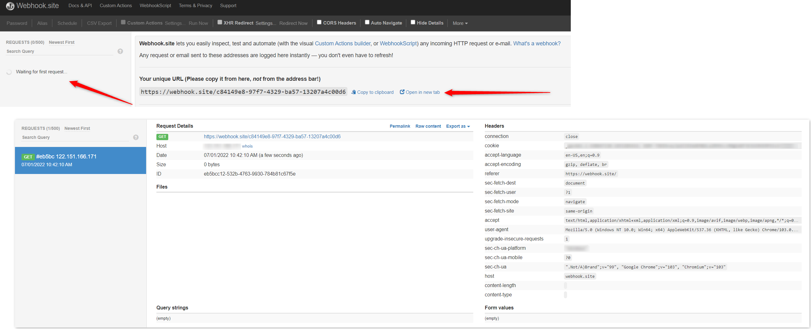

## Active vs. Passive Services

You already have an "active" service - the job executor service is actively running commands and sending the `task.started` and `task.finished` events.

Add a "passive" service to notify when a task is finished.

## Exercise: Notification when task is finished

We want a notification when a task is complete. We want to use the contents of the finished event to do something.

Some examples:

1. Be notified in Slack when an evaluation has finished and receive the result in Slack
2. Build a confluence page automatically based on the output of a load test

In a new browser window go to `https://webhook.site`. This site gives you a unique URL and will display anything you send to it. Try it out: In another tab, go to your unique URL and see that the `GET` request has been registered.

