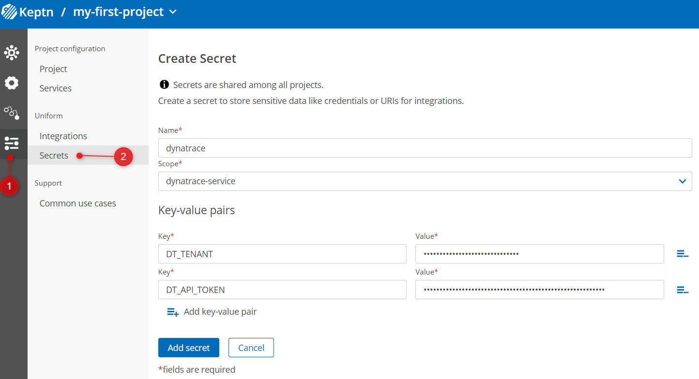
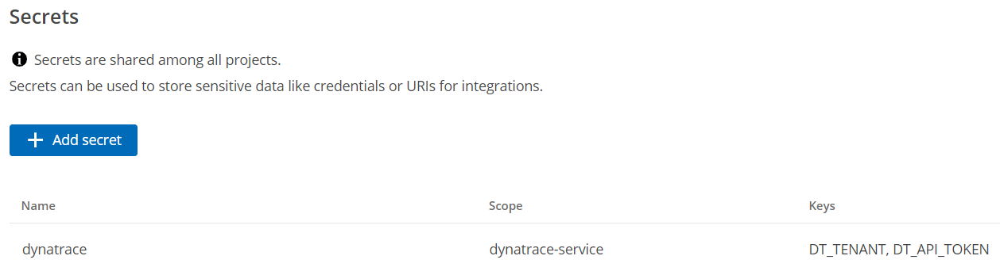
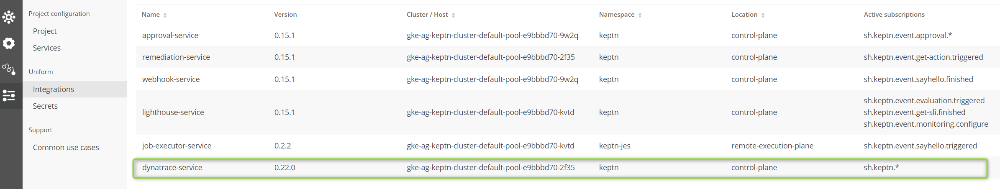
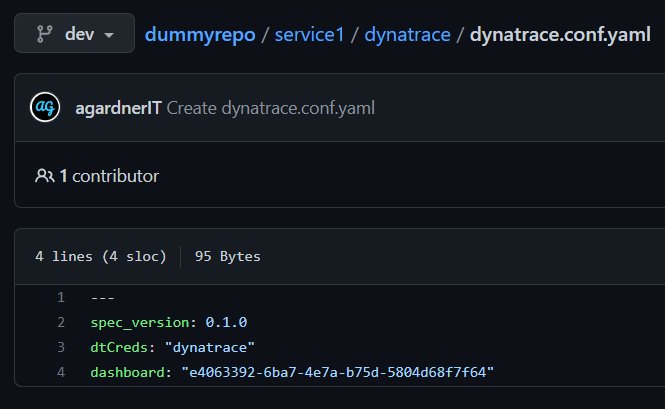
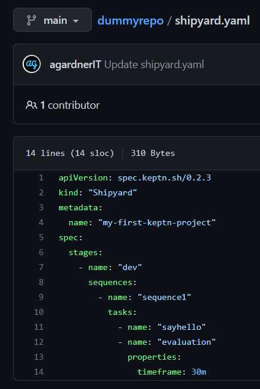
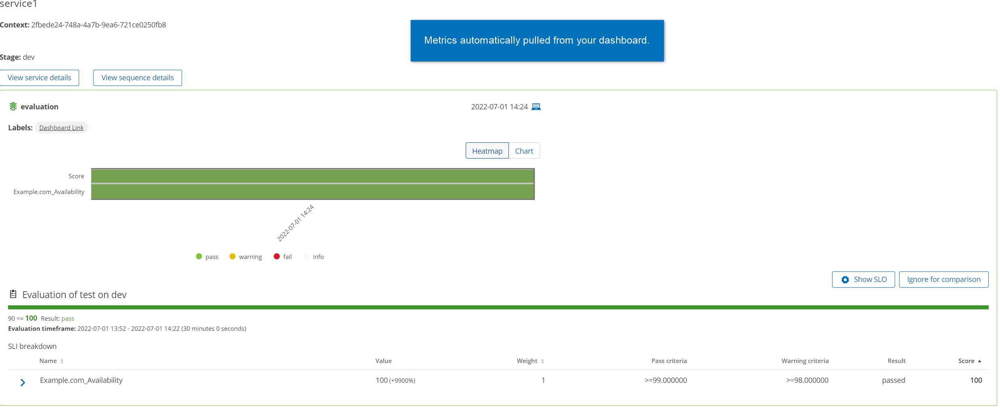
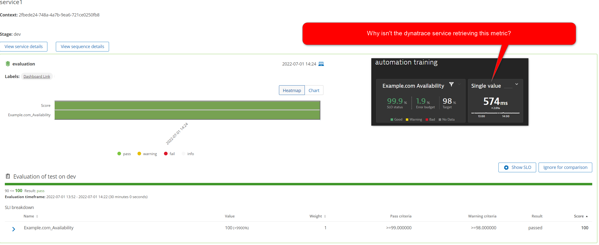

## Active vs. Passive Services

Previously you have created a Dynatrace dashboard and an API token.

## Create a Secret for Dynatrace Connection Details

We need to store some data about the Dynatrace environment.

Modify and set the details appropriate for your environment.

The convention is either `https://***.live.dynatrace.com` for SaaS (no trailing slash) or `https://{your-domain}/e/{your-environment-id}` for managed (no trailing slash).

> Yes: Keptn works with Managed. We will discuss considerations for SaaS vs. Managed later.

```
export DT_TENANT=https://{your-environment-id}.live.dynatrace.com
export DT_API_TOKEN=dtc01.****
```

Create the secret either programatically or using the bridge UI:
```
keptn create secret dynatrace --scope="dynatrace-service" --from-literal="DT_TENANT=$DT_TENANT" --from-literal="DT_API_TOKEN=$DT_API_TOKEN"
```



Whichever way you choose, the secret should now appear in Keptn:



## Install Dynatrace Service

> Please note: Cloud Automation already provides the Dynatrace service so this step can be skipped if using hosted Cloud Automation.

Natively, Keptn obviously does not know how to talk to, retrieve data or push data to third party tools such as Dynatrace. Hence we need to install the [Keptn Dynatrace Service](https://github.com/keptn-contrib/dynatrace-service). This microservice contains all of the logic about how to interact with, retrieve data, push events to and create configuration with Dynatrace.

Keptn is not opinionated on tooling and equivalent services exist for Prometheus and Datadog (and you can write your own to interact with any other backend you want).

Gather and set some details of your Keptn environment. Obviously use YOUR IP address here (no trailing slash!)

```
export KEPTN_ENDPOINT=http://1.2.3.4
export KEPTN_BRIDGE=http://1.2.3.4/bridge
```

Install the Dynatrace service:

```
helm upgrade --install dynatrace-service -n keptn \
https://github.com/keptn-contrib/dynatrace-service/releases/download/0.22.0/dynatrace-service-0.22.0.tgz \
--set distributor.image.tag=0.15.1 \
--set dynatraceService.config.keptnApiUrl=$KEPTN_ENDPOINT \
--set dynatraceService.config.keptnBridgeUrl=$KEPTN_BRIDGE_URL
```



## Configure project to use Dynatrace

Tell Keptn to use Dynatrace monitoring for this project:

```
keptn configure monitoring dynatrace --project my-first-project
```

This creates a ConfigMap in `keptn` that the lighthouse service uses to understand which monitoring provider it should use.
View it with `kubectl -n keptn get configmap lighthouse-config-my-first-project -o yaml`

## Tell Dynatrace Service Which Dashboard To Look For

The Dynatrace service configuration is installed and knows which tenant to look for, but it doesn't know which dashboard to retrieve metrics from or which secret to use (the secret called `dynatrace` created above).

These things are configured in the Git repository in a special file called `dynatrace.conf.yaml`.

On the `dev` branch inside the `service1` folder, create a new folder called `dynatrace` and inside there, create a file called `dynatrace.conf.yaml` with the following content:

```
---
spec_version: 0.1.0
dtCreds: dynatrace
dashboard: <YourDashboardIDHere>
```



## Add Evaluation to Your Sequence

Switch back to `main` in Git and modify the shipyard to add another task:

```
apiVersion: spec.keptn.sh/0.2.3
kind: "Shipyard"
metadata:
  name: "my-first-keptn-project"
spec:
  stages:
    - name: "dev"
      sequences:
        - name: "sequence1"
          tasks: 
            - name: "sayhello"
            - name: "evaluation"
              properties:
                timeframe: 30m
```



## Trigger Sequence

Trigger the `sequence1` sequence again just as you have always done.

This time your shell script `sayhello` task will execute. You will receive a notification to `webhook.site` when that task is finished. When that is done a quality gate evaluation will automatically run.

The Keptn dynatrace service will reach into Dynatrace and pull metrics from the nominated dashboard.



## Exercise: Why Is Keptn Only Retrieving One Metric When Two Tiles are Present?



In your groups, resolve this issue.

## Exercise: Send Evaluation Results to Webhook.Site

Your customer needs the results of each evaluation in a third party tool like Slack, MS Teams or as a JIRA ticket.

Configure Keptn to send a webhook to your `webhook.site` endpoint every time an evaluation runs.

Ensure the **evaluation result** (pass, warning or fail) and **score** is included in the output.

## Exercise: Dynamically Look Up Dashboard

The Dynatrace service is able to search a tenant for a dashboard. Reconfigure things so that rather than hardcoding a dashboard ID, it is retrieved dynamically.

Hint: The [Dynatrace service documentation](https://github.com/keptn-contrib/dynatrace-service) will help you.
